# Stability Analysis of an Aircraft
This repository contains code developed for the Stability Control Analysis of a D18 Beechcraft aircraft. The repository is split into multiple folders: Imgs, Proj Code, and Report. Imgs will contain the images referenced in the README section. Proj Code will contain the main script and objects. The decision to use object-oriented programming (OOP) was due to the interdependencies throughout the calculations. OOP allows each step of the analysis to be encapsulated independently, so all the Planform Parameterization can be done at once instead of having one function per parameter. The repository is finalized there is a report file that goes over what the project is about methodology and results. The README is just to provide background knowledge for those interested in the topic.

Topics Covered:

 1. Planform Geometric Parameterization

  
  Objective: Determine the aircraft's basic physical geometry, such as the theoretical wing area, span of the aircraft, mean chord length and location, etc... 

  Details: The PlanformParameterization object in the code is designed specifically for lifting surfaces like wings or horizontal tails (HT).
  
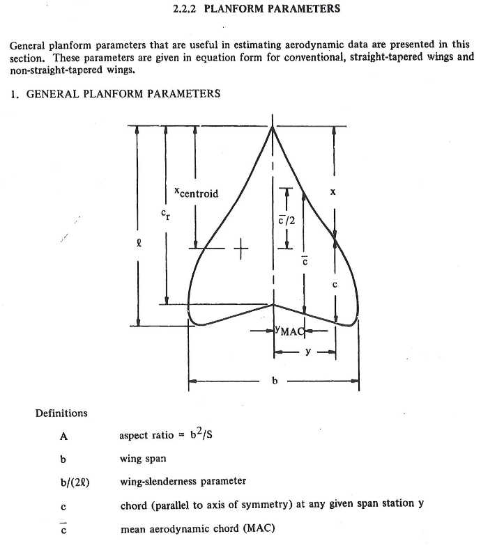

Fig 1. Datcom Manual page 2.2.2-1

2. Planform Aerodynamic Parameterization 

Objective: Apply aerodynamic parameterization to the wing and HT, but it can also be applied to other planforms such as Vertical Tails (VT) and Canards. 

Details: The code adjusts 2D (lower-case subscripts) aerodynamic parameters to 3D (upper-case subscripts). Experimental data, such as the lift curve slope, the coefficient of moment about the aerodynamic center, the zero lift angle of attack, and the aerodynamic center location, were obtained from "The Theory of Wing Sections" by Abbott and Von Doenhoff or the Datcom Manual. Afterwards, twist, compressibility, sweep, and aspect ratio were taken into account to shift parameters from 2D to 3D. These subscript rules weren't applied in the code but were in the hand calculations.

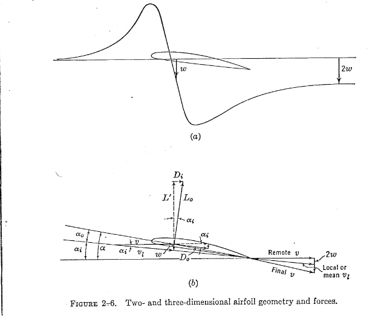

Fig 2. Perkins and Hage, S&C Text Book page 23 

  
   
3. Actual Downwash Gradient Calculation 

   
Objective: Calculate the actual downwash gradient (dϵ/dα) on an aircraft.

Details: This calculation uses the aerodynamic and geometric parameters of the wing and horizontal tail to determine the downwash effect experienced by the tail due to the wing's presence. It considers the incidence angles of both the wing and the tail to provide an accurate representation of the downwash effect based on the aircraft's geometry. The effectiveness on the HT is dependent on the downwash since it determines what percent of free-stream dynamic pressure is seen by the tail. For example, if it were to be fully immersed (dϵ/dα ≈ 0.5), it would only see around 90% of the free-stream dynamic pressure, whilst if it were dϵ/dα ≈ 0.4, the tail would see 95% of the free-stream dynamic pressure. These assumptions do not include power effects, which would make the HT experience a dynamic pressure ratio greater than the free-stream dynamic pressure.

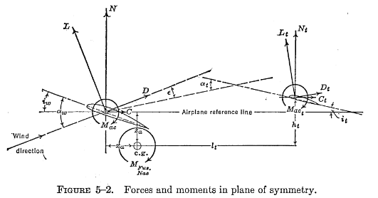

Fig 3. Perkins and Hage, S&C Text Book page 215

  
  
4. Multhopp's Method vs Gilruth and White's Method

  
Objective: To determine the change in nose-up pitching moment with angle of attack as a coefficient (Cmαf). The goal was to obtain a Cmαf of -0.01, representing that the aircraft has 10% stability.

Details: There are many methods to determine Cmαf of the aircraft. The three primary methods are Munk's, Gilruth and White's, and Multhopp's. Munk started to investigate pitching moments of streamlined bodies of blimps (uniform flow with sources and sinks) in 1924, using potential flow (inviscid) elements. This allowed him to define the pressure distribution over the streamlined body, establishing that a nose-up pitching moment exists (destabilizing), which increases with Angle of Attack (AoA).

Munk's analysis didn't take into account the upwash and downwash effect from the wings, whereas G&W's and Multhopp's did. The difference between the two is that G&W's method is a general equation that estimates the overall effect developed by wind tunnel test data. Whilst Multhopp's takes into account the local flow for every section forward and aft of the wing, making it more precise and accurate than Munk's and G&W's. Lastly, both Multhopp's and G&W's methods can also be applied to engine nacelles or tip tanks.

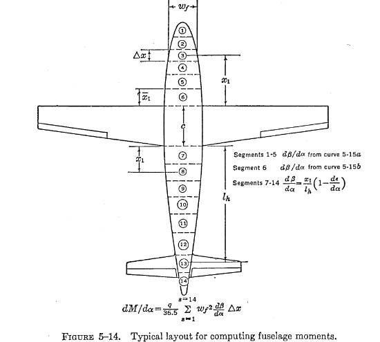

Fig 4. Perkins and Hage, S&C Text Book page 227

5. Glider Stability Calculations

Objective: Determine the stick-fixed neutral point based off both (Cmαf) (G&W's and Multhopp's). 

Details: The stick-fixed neutral point is a location on the aircraft where the change in pitching moment with respect to AoA and Coefficient of Lift are zero when the pilot is holding the yoke, giving it the name "stick-fixed" versus "stick-free." For a stick-free analysis, the elevators and their trims would need to be taken into account as well. A glider configuration will be analyzed first and will have the most aft neutral point. When more power is added, the neutral point will move forward, being the most forward when at full power. The range limitations of the center of gravity (CG) are dependent on the range of the neutral point throughout the aircrafts flight envelope. This is why performing weight and balance on an aircraft pre-flight is very important, as it can have serious effects on the aircraft's performance.

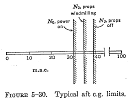

Fig 5. Perkins and Hage, S&C Text Book page 247

  

6. Power Effects

Objective: Determine the new stick-fixed neutral points for the windmilling power and full power case.

Details: In section 5, it was mentioned that as we turn on and increase the power, the neutral points will tend to move forward along the aircraft's Mean Aerodynamic Chord (MAC). Another effect is the increase in downwash at the HT if it is within the streamline tube of the propeller slipstream or jet wash (is not streamline tube). Knowing where the neutral point is at different power settings helps the engineer determine how the fuel management system should be designed. The reason is that displacing the fuel in the aircraft allows the CG to shift to the appropriate location during different phases of flight or flight conditions.
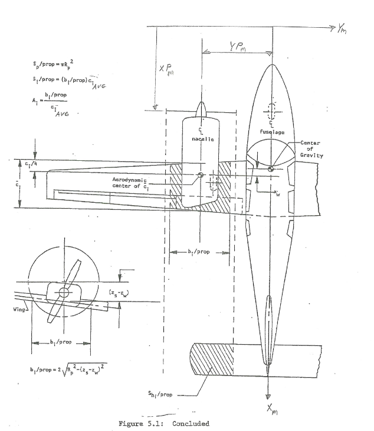 

Fig 6. Prof. Greiner's Notes

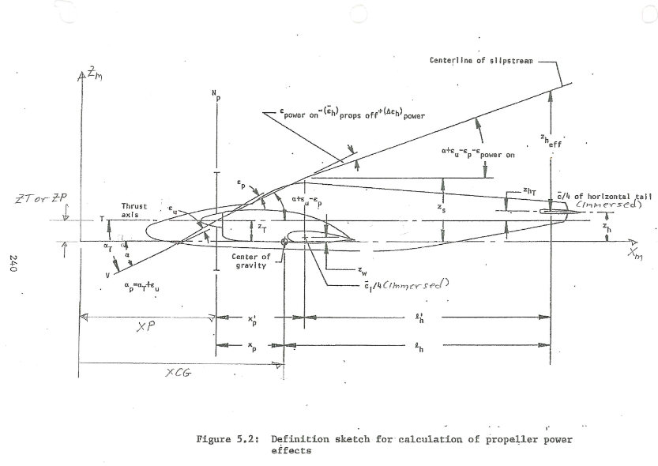 

Fig 7. Prof. Greiner's Notes

7. Side Force Gradient

Objective: Determine the Side Force Gradient based off Wing-Body Interactions, VT interactions, and Props Effects with rudder fixed stability.

Details: An aircraft has a VT and rudder control and trim to combat the side forces that can cause the aircraft to yaw. Knowing that there is a limit to the amount of sideslip an aircraft can handle, having a slope that engineers can use to determine the range of sideslip and sideforce the aircraft can handle is important. For this part of the analysis, we are only concerned about the sideforce due to wind vectors found at cruise since we can't provide rudder input as required by our rudder-fixed condition. This is why there are no terms in the code or hand calculations regarding engine-out or crosswind conditions since they require rudder input.

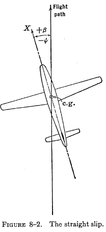  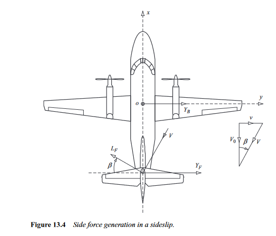 

Fig 8. (LHS) Perkins and Hage, S&C Text Book page 316 

Fig 9. (RHS) Flight Dynamics Principles by Micheal V. Cook pg 352

8. Directional Stability

Objective: Determine the Directional Stability Slope (per deg) to remain at equilibrium with zero sideslip with rudder fixed stability. 

Details: In regards to the rudder-fixed condition, the only terms used for calculations in this section are related to the wing, wing-body, VT, and propeller. The wing term is the sum of two hidden terms, corresponding to its dihedral and sweep angles. Dihedral has a stabilizing effect on the plane's rolling moment since the sideslip will cause a restoring torque on the aircraft. Sweep increases the stability effect of the dihedral when sideslipping since the local relative wind will see a weaker downward wind, signifying a weaker downwash. This can be seen in the figure below

  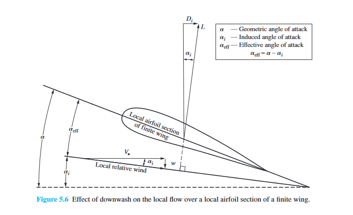  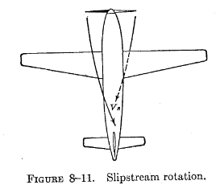 

Fig 10. Fundemental of Aerodynamics by John D. Anderson pg 429

Fig 11. Perkins and Hage, S&C Text Book page 328 

9. Lateral Stability

  Objective: Determine the Lateral Stability Slope (per deg) to remain at a wings leveled position stick fixed condition.

  Details: Lateral stability deals with the aircraft's rolling moment and maintaining it at static equilibrium. For lateral stability, there are three basic terms: the wing, wing-body, and VT terms. The wing term in this case contains four hidden terms attributed to the wing's sweep, aspect ratio, twist, and dihedral. The purpose of dihedral and sweep are the same as mentioned under the 'Directional Stability' section. The reason aspect ratio is taken into account is that wings with higher aspect ratios have a higher moment of inertia, limiting the amount of angular velocity they can obtain, indicating that aspect ratio and maneuverability have an inverse relationship. Moving on to twist, most planes have their wings twisted negatively (washout) so that when the aircraft stalls, the ailerons will still be able to provide lateral control. It also helps in reducing induced drag produced by the vortices that the wings generate, which in turn gives the aircraft more stability due to a decrease in the amount of external forces it is experiencing.

 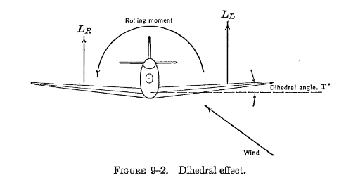

 Fig 12. Perkins and Hage, S&C Text Book page 343

  

10. References

1. Perkins, C. D., & Hage, R. E. (1949). Airplane performance, stability and control. John Wiley & Sons.

2. Anderson, J. D. (2020). Fundamentals of Aerodynamics (Sixth Edition).

3. Cook, M. V. (2012). Flight dynamics principles: A Linear Systems Approach to Aircraft Stability and Control. Butterworth-Heinemann.

4. ERAU Prof. Greiner Handmade Notes

5. Williams, J. E., & Vukelich, S. R. (1979). The USAF Stability and Control Digital DatCOM: Users manual. Volume I. 
  

